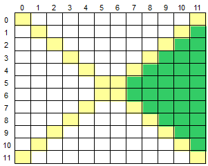

# Exercício de Manipulação de Array

## Objetivo

Observe a imagem:

### Entrada

Leia uma entrada com um único caractere Maiúsculo O ('S' ou 'M'), indicando a operação (Soma ou Média) que deverá ser realizada com os elementos da matriz.

A matriz será lida a partir do Arquivo: `data/matriz.json`.

### Saída

Calcule e mostre a soma ou a média considerando somente aqueles elementos que estão na área direita da matriz, conforme ilustrado abaixo (área verde).

Imprima o resultado solicitado (a soma ou média), com 1 casa após o ponto decimal.

## Autoria

O presente exercício foi retirado da plataforma Beecrowd, exercício 1190.